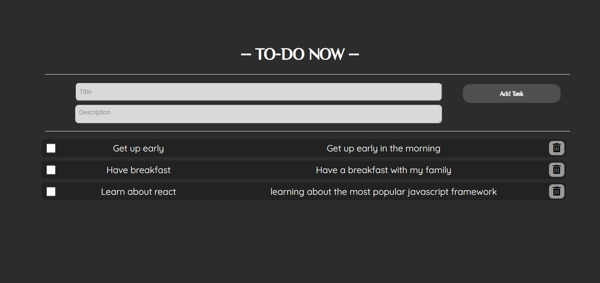

# React TodoList Lobium Test __ made by Gagik babayan 

this is a very simple todo list application written using React.js and Redux

<h3>How to run it</h3> 

```

  npm install

```
and then, 

```
  npm start
```

<h3>Results</h3>
